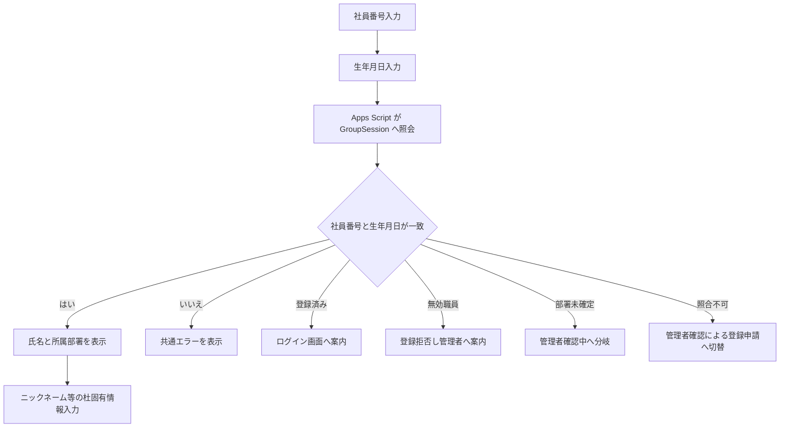

# ADMIN_USERS_PLAN

## 目的
GroupSession を職員基本情報の正本とし、りんちゃんの杜側は職員固有情報と利用履歴だけを保持する前提で、職員管理と GroupSession 連携の設計方針を確定する。

## 対象範囲
- 職員管理の設計
- GroupSession との接続方針
- 部署対応表の設計
- 同期プレビューの判定方針
- 初回登録時の本人確認導線

## 参照した現行実装
- [ADMIN_PLAN.md](ADMIN_PLAN.md)
- [DEVELOPMENT_RULES.md](DEVELOPMENT_RULES.md)
- [apps-script/Config.gs](apps-script/Config.gs)
- [apps-script/Setup.gs](apps-script/Setup.gs)
- [apps-script/User.gs](apps-script/User.gs)
- [apps-script/Permission.gs](apps-script/Permission.gs)
- [apps-script/Router.gs](apps-script/Router.gs)
- [js/features/auth.js](js/features/auth.js)
- [js/core/api.js](js/core/api.js)

## 1. 現在の職員データ構造

### 1-1. 既存の正本
現行の職員データは `users` シートが正本で、Apps Script の `saveUser` / `loginUser` / `getUserState` が参照している。

`setupProject()` では `users` シートに次の列を作成している。

| 列 | 意味 |
|---|---|
| id | 社員番号を兼ねる内部ID |
| deviceId | 端末ID |
| name | 氏名 |
| dept | りんちゃんの杜の部署名 |
| nick | ニックネーム |
| declaration | 個人宣言 |
| weeklyGoal | 週間歩数目標の旧列 |
| createdAt | 作成日時 |
| updatedAt | 更新日時 |
| version | 保存時バージョン |
| lastSavedAt | 最終保存日時 |
| email | メールアドレス |
| pin4 | ログイン用誕生日4桁 |
| employeeId | 社員番号 |
| admin | 管理者フラグ |
| weeklyStepGoal | 週間歩数目標の新列 |
| role | ロール |

### 1-2. 現行の認証データ
`rinchanParticipant` はブラウザ側の現在ユーザー情報の保存先で、`js/features/auth.js` と `js/core/api.js` が参照している。

現行コード上で見えている主な項目は次のとおり。
- `employeeId`
- `id`
- `participantId`
- `name`
- `dept`
- `nick`
- `email`
- `pin4`
- `admin`
- `role`
- `weeklyGoal`
- `weeklyStepGoal`
- `declaration`
- `createdAt`
- `updatedAt`
- `version`

### 1-3. 現行の関連シート
職員管理に直接関係する既存シートは `users` と `departments` で、周辺に `activities`、`thanks`、`user_reads`、`notices`、`audit_logs` などがある。

### 1-4. 現行の注意点
- `saveUser` は `employeeId` を文字列として扱い、既存行があれば更新、なければ追加する。
- `loginUser` は `employeeId` または `email` と `pin4` を使って照合する。
- `publicUser()` は画面や API に返す公開項目を絞っている。
- 現行実装には GroupSession 連携は存在しない。

## 2. GroupSession との項目対応

### 2-1. 基本方針
- GroupSession を職員基本情報の正本とする。
- りんちゃんの杜から GroupSession は変更しない。
- 社員番号を共通の照合キーとし、GroupSession のログイン ID と社員番号は同一とみなす。
- 社員番号は文字列として扱い、登録後は原則変更しない。
- GroupSession から取得した情報は、同期プレビューと登録確認にのみ使い、不要な個人情報は保持しない。

### 2-2. 同期対象
| GroupSession項目 | りんちゃんの杜側項目 | 同期方針 |
|---|---|---|
| ユーザーSID | groupSessionSid | 保持対象 |
| ログインID | employeeId | 社員番号として保持 |
| 社員番号 | employeeId | 照合キー兼保持対象 |
| 氏名 | name | 保持対象 |
| 所属グループ | groupSessionGroups | 保持対象 |
| 役職 | title | 保持対象 |
| ユーザー有効・無効状態 | status | 保持対象 |
| 更新日時 | groupSessionUpdatedAt | 保持対象 |

### 2-3. 同期しない項目
| GroupSession項目 | 方針 |
|---|---|
| 住所 | 保持しない |
| 電話番号 | 保持しない |
| 個人メールアドレス | 保持しない |
| その他、りんちゃんの杜で使わない個人情報 | 保持しない |

### 2-4. りんちゃんの杜だけで管理する項目
| 項目 | 方針 |
|---|---|
| ニックネーム | りんちゃんの杜で管理 |
| 週間歩数目標 | りんちゃんの杜で管理 |
| 個人宣言 | りんちゃんの杜で管理 |
| 管理者権限 | りんちゃんの杜で管理 |
| 歩数 | りんちゃんの杜で管理 |
| ありがとう | りんちゃんの杜で管理 |
| バッジ | りんちゃんの杜で管理 |
| チャレンジ | りんちゃんの杜で管理 |
| イベント参加履歴 | りんちゃんの杜で管理 |
| 既読履歴 | りんちゃんの杜で管理 |

## 3. 部署対応表の設計

### 3-1. 方針
- GroupSession とりんちゃんの杜では組織階層と部署粒度が異なるため、名称の自動一致は使わない。
- GroupSession のグループSID と、りんちゃんの杜の部署ID を対応付ける。
- 1つのりんちゃんの杜部署に対して、複数の GroupSession グループを対応可能にする。
- 委員会、プロジェクトなど、部署判定に使わないグループを設定可能にする。
- 未登録グループを勝手に「その他」に割り当てない。

### 3-2. 対応表の想定項目
| 項目 | 役割 |
|---|---|
| GroupSessionグループSID | GroupSession 側の一意キー |
| GroupSessionグループ名 | 表示用 |
| GroupSession階層 | 判定補助 |
| りんちゃんの杜部署ID | 対応先キー |
| りんちゃんの杜部署名 | 表示用 |
| 部署判定に使用するか | 除外設定 |
| 優先順位 | 複数候補時の判断材料 |
| 更新日時 | 変更履歴 |
| 更新者 | 変更履歴 |

### 3-3. 既存部署との整合
現行のりんちゃんの杜部署は `departments` シートで管理され、少なくとも次の部署がある。
- 医局
- 看護部
- 医療技術部
- 地域医療連携室
- 事務部
- グループホーム
- ケアサポ
- その他

### 3-4. 更新運用
- 対応表の自動生成はしない。
- 管理者が GroupSession のグループ名・階層・実運用を見て手動で確認する。
- 変更は差分確認後にのみ反映する。
- 第一段階では対応表の編集APIは作らず、読み取りとプレビューだけに留める。

## 4. 同期プレビューの判定方法

### 4-1. 第一段階の分類
職員を次の5分類で表示する。
- 新規候補
- 更新候補
- 変更なし
- 利用停止候補
- 要確認

### 4-2. 判定順序
1. GroupSession 側で無効扱いの職員を判定する。
2. 社員番号で既存のりんちゃんの杜職員を照合する。
3. GroupSession グループ SID を部署対応表で引く。
4. 1つの候補部署に定まるなら、その部署を採用する。
5. 複数候補がある場合は優先順位で絞る。
6. 判定できない場合は「要確認」にする。
7. 未登録グループはその他へ寄せず、要確認に残す。

### 4-3. 分類条件
| 分類 | 条件 |
|---|---|
| 新規候補 | りんちゃんの杜に未登録で、GroupSession 側に有効な職員として存在する |
| 更新候補 | 既存登録あり、氏名・部署・役職・有効状態・更新日時のいずれかが変化している |
| 変更なし | 既存登録あり、照合結果に差分がない |
| 利用停止候補 | GroupSession 側で無効だが、りんちゃんの杜の履歴は残す必要がある |
| 要確認 | 部署未確定、複数候補、BirthdayKf 照合不可、整合性不足 |

### 4-4. プレビュー表示項目
- 社員番号
- 氏名
- GroupSession所属グループ
- 現在のりんちゃんの杜部署
- 判定後の部署候補
- 変更内容
- 判定理由

### 4-5. 重要な禁止事項
- 自動登録しない。
- 自動更新しない。
- 自動退職しない。
- 管理者が差分を確認してから反映する。

## 5. 生年月日の扱い

### 5-1. 基本方針
- 生年月日は初回登録時の本人確認だけに使用する。
- りんちゃんの杜へ保存しない。
- 管理画面へ表示しない。
- Apps Script 内で照合し、一致・不一致だけを返す。

### 5-2. 初回登録の動線

### 5-3. 失敗時の扱い
- 不一致時は、社員番号の存在有無が分からない共通エラーを返す。
- 登録済みの場合は、ログイン画面へ案内する。
- GroupSession で無効な職員は登録を拒否し、管理者への問い合わせを案内する。
- 部署対応が未設定または複数候補の場合は、自分で部署を選ばせず「管理者確認中」とする。
- BirthdayKf などにより生年月日を照合できない場合は、管理者確認による登録申請へ切り替える。

### 5-4. 実環境確認事項
- BirthdayKf が非公開の場合の動作は実環境で確認する。
- その場合の照合可否と代替分岐は、実データで決める。

## 6. 認証・監査方針

### 6-1. 接続方式
- GroupSession のベースURLは `https://gs.hayashi.fun/gsession/` とする。
- ブラウザから直接接続しない。
- Apps Script から HTTPS で接続する。
- 認証情報は Script Properties に保存する。
- GitHub、JavaScript、スプレッドシートのセルには保存しない。
- 可能なら連携専用ユーザーを使用する。
- BASIC 認証またはトークン認証を使用する。
- API 応答は XML として処理する。

### 6-2. 管理者制御
- 管理者だけが接続確認と同期プレビューを実行可能にする。
- API 側でも管理者権限を確認する。
- GroupSession 接続確認と同期プレビュー実行を監査ログへ記録する。
- 認証情報や生年月日をログへ残さない。

### 6-3. 監査対象の第一候補
- adminGroupSessionConnectionTest
- adminGroupSessionGroupList
- adminGroupSessionUserPreview

## 7. 第一段階の実装対象

### 7-1. 実装するもの
- GroupSession 接続確認
- グループ一覧取得
- 職員同期プレビュー

### 7-2. 実装しないもの
- 登録API
- 更新API
- 利用停止API
- 退職API
- 部署自動割当
- 生年月日保存

### 7-3. 画面・APIの候補名
- `adminGroupSessionConnectionTest`
- `adminGroupSessionGroupList`
- `adminGroupSessionUserPreview`

### 7-4. 実装順
1. GroupSession接続確認
2. グループ一覧取得
3. 部署対応表
4. 職員同期プレビュー
5. 管理者による結果確認
6. 新規登録
7. 氏名・部署・役職更新
8. 利用停止・退職候補確認
9. 初回登録時の生年月日照合

## 8. 初回登録の分岐

### 8-1. 成功時
- 社員番号と生年月日が一致した場合のみ、氏名と所属部署を表示する。
- その後に、ニックネームや週間歩数目標など、りんちゃんの杜固有情報を入力させる。

### 8-2. 失敗時
- 一致しない場合は共通エラーのみ表示する。
- 社員番号の存在有無は見せない。

### 8-3. 登録済み
- 既に登録済みならログイン画面へ案内する。

### 8-4. 利用停止
- GroupSession で無効な職員は登録を拒否する。
- ただし歩数、ありがとう、バッジ、監査履歴は保持する。

### 8-5. 部署未確定
- 部署対応が未設定または複数候補の場合は、登録者に部署選択させない。
- 管理者確認中に切り替える。

### 8-6. 照合不可
- 生年月日が照合できない場合は、管理者確認による登録申請へ切り替える。

## 9. 未確定事項
- GroupSession の実際の XML レスポンス形式
- `/api/user/search.do`、`/api/user/groupl.do`、`/api/user/belong.do`、`/api/user/inf.do`、`/api/user/whoami.do` の実際の使い分け
- BASIC 認証とトークン認証のどちらを本番採用するか
- 連携専用ユーザーの有無
- BirthdayKf 非公開時の実環境挙動
- グループ SID と部署 ID の初期対応表
- 利用停止候補を将来どの状態名で持つか
- プレビューと本登録の間でどこまで差分を表示するか

## 10. 作成ファイル
- [ADMIN_USERS_PLAN.md](ADMIN_USERS_PLAN.md)

## 11. 補足
- この文書は設計文書であり、HTML、CSS、JavaScript、Apps Script は変更しない。
- README.md と CHANGELOG.md も更新しない。
- 推測で既存仕様を変えず、現行コードと整合する範囲に限定する。