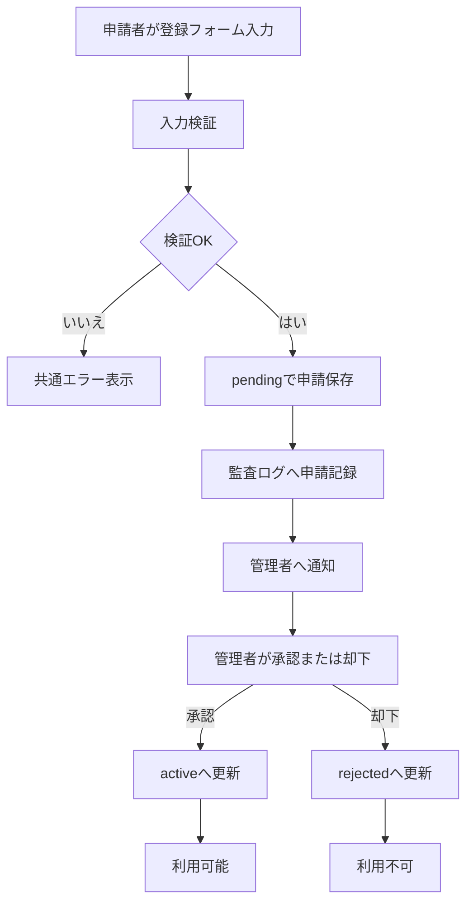
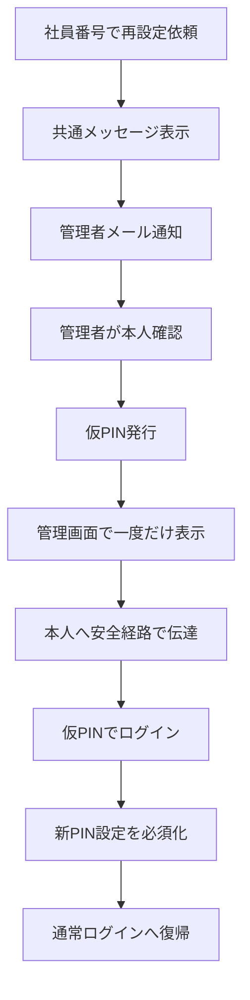

# ADMIN_USERS_PLAN

## 目的
GroupSession 連携を使用しない単独運用の職員管理を設計し、申請、承認、状態管理、PIN 再設定の運用ルールを確定する。

## 対象範囲
- 職員の初回登録申請
- 管理者承認と却下
- 職員状態管理
- PIN 再設定
- 監査ログ方針

## 非対象
- GroupSession Web API 連携
- CSV 同期
- 生年月日による本人確認
- 自動同期、自動更新、自動退職

## 参照した現行実装
- [ADMIN_PLAN.md](ADMIN_PLAN.md)
- [DEVELOPMENT_RULES.md](DEVELOPMENT_RULES.md)
- [apps-script/Setup.gs](apps-script/Setup.gs)
- [apps-script/User.gs](apps-script/User.gs)
- [apps-script/Permission.gs](apps-script/Permission.gs)
- [apps-script/Router.gs](apps-script/Router.gs)
- [js/features/auth.js](js/features/auth.js)

## 1. 運用方針
- GroupSession API 連携は採用しない。
- CSV 連携は採用しない。
- 生年月日は取得しない、保存しない、照合しない。
- 利用希望者が自分で登録申請する。
- 登録申請は管理者承認後に利用可能とする。
- 社員番号は登録後に原則変更不可とする。
- 職員情報は物理削除せず状態管理する。

## 2. 職員状態

| 状態 | 意味 |
|---|---|
| pending | 承認待ち |
| active | 利用中 |
| suspended | 利用停止 |
| retired | 退職 |
| rejected | 申請却下 |

補足:
- 物理削除は行わない。
- 歩数、ありがとう、バッジ、監査履歴は状態変更後も保持する。

## 3. 初回登録設計

### 3-1. 申請者入力項目
- 社員番号
- 氏名
- 部署
- ニックネーム
- 希望PIN
- PIN確認

### 3-2. 入力要件
- 社員番号、氏名、部署、PIN は必須。
- 社員番号の重複登録を禁止。
- 画面上で登録済み社員番号の有無を不用意に開示しない。

### 3-3. 初回登録時の状態遷移
- 新規申請時の初期状態は pending。
- pending 中はログイン不可。
- 管理者が申請内容を確認し、承認または却下する。
- 承認後に active となり利用可能。
- 却下時は rejected とする。

### 3-4. 初回登録フロー

## 4. PINを忘れた場合の設計

### 4-1. 利用者向け動線
1. ログイン画面の PIN を忘れた方向け導線から社員番号を送信する。
2. 画面には登録有無にかかわらず共通メッセージを表示する。
3. 管理者メールへ再設定依頼を通知する。

### 4-2. 管理者向け動線
1. 管理者が本人確認を行う。
2. 管理者が6桁の仮PINを発行する。
3. 仮PINは管理画面に一度だけ表示する。
4. 管理者が本人へ対面、電話、院内連絡などで伝える。
5. 本人は仮PINでログインし、新しいPIN設定を必須とする。

### 4-3. PIN再設定フロー

## 5. 仮PINルール
- 有効期限は24時間。
- 1回のみ使用可能。
- 5回失敗すると無効。
- 発行時に以前のPINを無効化。
- 仮PINをメール本文へ記載しない。
- 仮PINや通常PINを平文保存しない。
- 同一社員番号の再設定依頼は1時間に1回まで。
- suspended、retired、rejected は再設定不可。
- リセット申請、発行、利用、PIN変更を監査ログへ記録する。

## 6. 管理者メール
- Script Properties の ADMIN_SUPPORT_EMAIL を使用する。
- メールアドレスをコードへ直接記載しない。
- 通知に含める項目は社員番号、登録氏名、部署、申請日時、管理画面確認案内。
- PIN や仮PIN は通知に含めない。

## 7. 管理画面の第一版要件
- 承認待ち一覧
- 申請内容確認
- 承認
- 却下
- 職員一覧
- 状態変更
- PINリセット
- 仮PINの一度だけの表示
- 監査ログ確認

## 8. 監査ログ方針

### 8-1. 記録対象
- 登録申請
- 承認
- 却下
- 状態変更
- PINリセット申請
- 仮PIN発行
- 仮PIN利用
- PIN変更

### 8-2. 記録する情報
- 操作種別
- 実行者
- 対象社員番号
- 結果
- 実行日時

### 8-3. 記録しない情報
- PIN値
- 仮PIN値
- 生年月日
- 認証情報

## 9. 不採用または将来案へ移動する項目
- GroupSession Web API 接続
- GroupSession との項目同期
- グループSIDと部署の対応表
- 生年月日による本人確認
- CSV 同期
- 自動利用停止候補判定

## 10. 現行コードとの整合と実装時確認
この設計は現行コードに対して将来実装の方向を示す。次の点は実装時に確認が必要。

- 現行ログインは pin4 前提であり、希望PINの桁数やハッシュ保存方式は未確定。
- 現行 saveUser は pending 承認フローを持たないため、状態列と承認処理の追加方針を要確認。
- 現行画面には承認待ち一覧、却下、PINリセット専用UIがない。
- 現行監査ログは登録申請や仮PIN利用のイベント定義が未整備。
- 現行の GroupSession 接続テストコードは今回の方針では不採用だが、コード削除は今回行わない。

## 11. 実装順（単独運用案）
1. 登録申請APIと pending 状態保存
2. 管理者承認と却下API
3. 職員状態変更API
4. PIN再設定申請API
5. 仮PIN発行と一度だけ表示
6. 仮PINログイン後のPIN変更必須化
7. 監査ログ拡張

## 12. 補足
- 今回は設計文書のみ更新する。
- HTML、CSS、JavaScript、Apps Script は変更しない。
- README.md と CHANGELOG.md は変更しない。
- バージョン番号は変更しない。